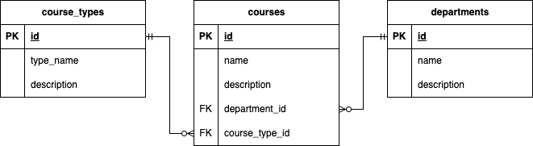

# РГР: “Разработка приложения учета курсов в учебном заведении”

Необходимо разработать программу по учету курсов в учебном заведении. Курсы проводятся департаментами (математика, информатика, физика, биология, инженерия), и могут быть разного типа (онлайн, оффлайн, смешанный, практикум, семинар) и пр.

## Концептуальное и логическое проектирование БД

В рамках моделирования предметной области предлагается выделить сущности `курс`, `департамент` и `тип курса`. При этом один департамент может проводить множество курсов, только один курс или не проводить вовсе, а курс может проводиться только строго одним департаментом. Также курс имеет строго один тип, который, в свою очередь, может относиться как ко многим, так и к одному курсу или не относиться ни к одному (например, в моменте времени отсутствует в принципе онлайн курс). 



## Физическое проектирование (PostgreSQL)

Для создания такой структуры необходимо выполнить следующие SQL запросы

```sql
-- Таблица справочника факультетов
CREATE TABLE departments (
    id SERIAL PRIMARY KEY,
    name TEXT NOT NULL,
    code VARCHAR(5) NOT NULL
);

-- Таблица справочника типов курсов
CREATE TABLE course_types (
    id SERIAL PRIMARY KEY,
    type_name TEXT NOT NULL,
    description TEXT
);

-- Основная таблица курсов
CREATE TABLE courses (
    id SERIAL PRIMARY KEY,
    name TEXT NOT NULL,
    description TEXT,
    department_id INT REFERENCES departments(id),
    course_type_id INT REFERENCES course_types(id)
);
```

## Физическое проектирование (SQLite)

Для создания такой структуры необходимо выполнить следующие SQL запросы

```sql
-- Таблица справочника факультетов
CREATE TABLE departments (
    id INTEGER PRIMARY KEY AUTOINCREMENT,
    name TEXT NOT NULL,
    code TEXT NOT NULL
);

-- Таблица справочника типов курсов
CREATE TABLE course_types (
    id INTEGER PRIMARY KEY AUTOINCREMENT,
    type_name TEXT NOT NULL,
    description TEXT
);

-- Основная таблица курсов
CREATE TABLE courses (
    id INTEGER PRIMARY KEY AUTOINCREMENT,
    name TEXT NOT NULL,
    description TEXT,
    department_id INTEGER,
    course_type_id INTEGER,
    FOREIGN KEY (department_id) REFERENCES departments(id) ON DELETE RESTRICT,
    FOREIGN KEY (course_type_id) REFERENCES course_types(id) ON DELETE RESTRICT
);
```

## Заполнение данными справочных таблиц

Чтобы заполнить справочные таблицы, необходимо выполнить следующие SQL запросы

```sql
INSERT INTO departments 
(name, code) 
VALUES
('Математика', 'MATH'),
('Информатика', 'CS'),
('Физика', 'PHYS'),
('Биология', 'BIO'),
('Инженерия', 'ENG');

INSERT INTO course_types 
(type_name, description) 
VALUES
('Онлайн', 'Курсы, проводимые онлайн'),
('Оффлайн', 'Курсы, проводимые на кампусе'),
('Смешанный', 'Курсы, сочетающие онлайн и оффлайн форматы'),
('Практикум', 'Практическое обучение и тренировки'),
('Семинар', 'Малые групповые обсуждения или лекции');
```

## Описание SELECT запросов в приложении

Приложение использует несколько `SELECT` запросов для получения данных из базы данных PostgreSQL. Эти запросы позволяют фильтровать курсы по различным критериям, получать информацию о конкретных курсах и извлекать данные о типах курсов и департаментах. Вот подробное описание каждого запроса, применительно к программе:

### 1. **Запрос для получения списка курсов с фильтрацией**

```sql
SELECT courses.id, courses.name, departments.code, course_types.type_name
FROM courses
JOIN departments ON departments.id = courses.department_id
JOIN course_types ON course_types.id = courses.course_type_id
```

**Описание:**
Этот запрос извлекает данные о курсах, включая:

- `courses.id` — уникальный идентификатор курса.
- `courses.name` — название курса.
- `departments.code` — код департамента, к которому относится курс.
- `course_types.type_name` — тип курса.

**Условия (фильтрация):**

- Если переданы значения фильтров, к запросу добавляются дополнительные условия:
    - Фильтрация по типу курса (`courses.course_type_id = %s`).
    - Фильтрация по департаменту (`courses.department_id = %s`).
    - Поиск по названию курса (`courses.name ILIKE %s`).

**Где используется:**
Этот запрос используется в функции `fetch_courses()`, которая отвечает за получение списка курсов с учетом фильтров (тип курса, департамент) и поиска по названию. Запрос применяется при каждом обновлении таблицы курсов в интерфейсе программы, когда пользователь нажимает кнопку "Обновить список" или меняет фильтры.

**Пагинация:**

- Данные выбираются с помощью параметров `LIMIT` и `OFFSET`, что позволяет загружать курсы постранично (по 10 на страницу, как указано в константе `ITEMS_PER_PAGE`).

### 2. **Запрос для подсчета количества курсов**

```sql
SELECT COUNT(*)
FROM courses
JOIN departments ON departments.id = courses.department_id
JOIN course_types ON course_types.id = courses.course_type_id
```

**Описание:**
Этот запрос подсчитывает общее количество курсов в базе данных, которые соответствуют заданным условиям фильтрации. Он возвращает одно значение — количество курсов, подходящих под текущие фильтры и параметры поиска.

**Условия (фильтрация):**

- Аналогично предыдущему запросу, добавляются условия фильтрации:
    - Фильтрация по типу курса (`courses.course_type_id = %s`).
    - Фильтрация по департаменту (`courses.department_id = %s`).
    - Поиск по названию курса (`courses.name ILIKE %s`).

**Где используется:**
Этот запрос применяется в функции `count_courses()`, которая отвечает за подсчет количества курсов для корректной работы системы пагинации. Используется для расчета общего числа страниц и отображения текущей страницы в интерфейсе программы.

### 3. **Запрос для получения данных о конкретном курсе**

```sql
SELECT courses.name, courses.description, departments.name AS department, course_types.type_name
FROM courses
JOIN departments ON courses.department_id = departments.id
JOIN course_types ON courses.course_type_id = course_types.id
WHERE courses.id = %s
```

**Описание:**
Этот запрос извлекает полные данные о конкретном курсе по его уникальному идентификатору (ID). В результатах возвращаются:

- `courses.name` — название курса.
- `courses.description` — описание курса.
- `departments.name` — название департамента, к которому относится курс.
- `course_types.type_name` — тип курса.

**Условие:**

- Запрос включает условие `WHERE courses.id = %s`, которое гарантирует, что будут получены данные только о курсе с заданным ID.

**Где используется:**
Этот запрос используется в следующих функциях:

- `fetch_course_by_id()`: функция, которая извлекает данные о конкретном курсе для редактирования или просмотра.
- Применяется при открытии диалогов:
    - **AddEditCourseDialog** — для загрузки данных курса при редактировании.
    - **CourseDetailsDialog** — для отображения полной информации о курсе при просмотре.

### 4. **Запрос для получения списка типов курсов**

```sql
SELECT id, type_name FROM course_types
```

**Описание:**
Запрос извлекает данные о типах курсов из таблицы `course_types`, включая:

- `id` — уникальный идентификатор типа курса.
- `type_name` — название типа курса (например, "Лекция", "Семинар" и т.д.).

**Где используется:**
Этот запрос используется в функции `fetch_course_types()`, которая заполняет выпадающий список типов курсов (`QComboBox`) при фильтрации, а также при добавлении или редактировании курса. Выпадающий список позволяет пользователю выбрать тип курса для фильтрации, добавления или редактирования.

### 5. **Запрос для получения списка департаментов**

```sql
SELECT id, name FROM departments
```

**Описание:**
Запрос извлекает данные о департаментах из таблицы `departments`, включая:

- `id` — уникальный идентификатор департамента.
- `name` — название департамента.

**Где используется:**
Этот запрос используется в функции `fetch_departments()`, которая заполняет выпадающий список департаментов (`QComboBox`) при фильтрации, а также при добавлении или редактировании курса. Выпадающий список предоставляет пользователю возможность выбирать департамент для курса.

### 6. **Запрос для удаления курса (не SELECT, но важен)**

```sql
DELETE FROM courses WHERE id = %s
```

**Описание:**
Этот запрос удаляет курс из базы данных по его уникальному идентификатору (ID). Используется для удаления курса, выбранного пользователем.

**Где используется:**
Запрос используется в функции `delete_course()` и применяется при подтвержденном удалении курса. Эта функция вызывается при нажатии кнопки "Удалить курс" и подтверждении удаления через диалоговое окно.

# Разработка приложения на PySide6 и PostgreSQL/SQLite

### Описание проекта

Приложение предназначено для управления курсами в учебной системе. Оно позволяет пользователям добавлять, редактировать, просматривать и удалять курсы. Приложение поддерживает две базы данных: **PostgreSQL** и **SQLite**, выбор базы данных осуществляется через конфигурационный файл.

### Технологический стек

- **Python** — основной язык программирования.
- **PySide6** — библиотека для создания графического интерфейса (GUI).
- **psycopg2** — библиотека для работы с PostgreSQL.
- **sqlite3** — стандартная библиотека для работы с SQLite.
- **configparser** — библиотека для чтения конфигурационных файлов.

### Структура проекта

1. **Конфигурационный файл (`config.ini`)**:
Файл конфигурации определяет тип базы данных, параметры подключения, а также состояние инициализации базы данных. 
    
    Пример содержимого файла Для PostgreSQL
    ```
    [Database]
    type = postgresql
    host = localhost
    port = 5432
    database = your_db_name
    user = your_user
    password = your_password
    
    [App]
    init = false
    ```
   
    Пример содержимого файла Для SQLite
    ```
    [Database]
    type = sqlite
    filename = your_sqlite.db
    
    [App]
    init = false
    ```
    
2. **Функция подключения к базе данных (`get_db_connection()`)**:
Эта функция обрабатывает выбор базы данных в зависимости от настроек конфигурационного файла и возвращает соединение к базе данных.
    
    ```python
    def get_db_connection():
        if DATABASE_TYPE == 'sqlite':
            conn = sqlite3.connect(config.get('Database', 'filename'))
            conn.execute("PRAGMA foreign_keys = 1")
        elif DATABASE_TYPE == 'postgresql':
            conn = psycopg2.connect(
                dbname=config.get('Database', 'database'),
                user=config.get('Database', 'user'),
                password=config.get('Database', 'password'),
                host=config.get('Database', 'host'),
                port=config.get('Database', 'port')
            )
        else:
            raise ValueError("Unsupported database type")
        return conn
    ```
    
3. **Скрипты для создания таблиц (`POSTGRESQL_CREATE_SCRIPT` и `SQLITE_CREATE_SCRIPT`)**:
При первом запуске приложение проверяет конфигурацию и создает необходимые таблицы для хранения курсов, факультетов и типов курсов.
    
    Пример скрипта для PostgreSQL:
    
    ```sql
    -- Таблица справочника факультетов
    CREATE TABLE IF NOT EXISTS departments (
        id SERIAL PRIMARY KEY,
        name TEXT NOT NULL,
        code VARCHAR(5) NOT NULL
    );
    
    -- Таблица справочника типов курсов
    CREATE TABLE IF NOT EXISTS course_types (
        id SERIAL PRIMARY KEY,
        type_name TEXT NOT NULL,
        description TEXT
    );
    
    -- Основная таблица курсов
    CREATE TABLE IF NOT EXISTS courses (
        id SERIAL PRIMARY KEY,
        name TEXT NOT NULL,
        description TEXT,
        department_id INT REFERENCES departments(id),
        course_type_id INT REFERENCES course_types(id)
    );
    ```
    
    Для SQLite:
    
    ```sql
    -- Таблица справочника факультетов
    CREATE TABLE IF NOT EXISTS departments (
        id INTEGER PRIMARY KEY AUTOINCREMENT,
        name TEXT NOT NULL,
        code TEXT NOT NULL
    );
    
    -- Таблица справочника типов курсов
    CREATE TABLE IF NOT EXISTS course_types (
        id INTEGER PRIMARY KEY AUTOINCREMENT,
        type_name TEXT NOT NULL,
        description TEXT
    );
    
    -- Основная таблица курсов
    CREATE TABLE IF NOT EXISTS courses (
        id INTEGER PRIMARY KEY AUTOINCREMENT,
        name TEXT NOT NULL,
        description TEXT,
        department_id INTEGER,
        course_type_id INTEGER,
        FOREIGN KEY (department_id) REFERENCES departments(id) ON DELETE RESTRICT,
        FOREIGN KEY (course_type_id) REFERENCES course_types(id) ON DELETE RESTRICT
    );
    ```
    
4. **Основной интерфейс приложения (`CourseManager`)**:
Главное окно приложения, которое состоит из:
    - **Фильтров** для поиска курсов.
    - **Таблицы курсов** для отображения списка курсов.
    - **Кнопок управления** для добавления, редактирования, удаления и просмотра курсов.
    - **Пагинации** для перелистывания страниц с курсами.
5. **Диалоги добавления/редактирования курсов (`AddEditCourseDialog`) и просмотра курсов (`CourseDetailsDialog`)**:
Эти диалоги позволяют пользователю создавать, изменять или просматривать курсы. Например, при редактировании загружаются текущие данные курса, а при сохранении они обновляются в базе данных.

### Основные функции приложения

1. **Проверка и инициализация базы данных**:
При первом запуске приложение проверяет, была ли инициализирована база данных. Если нет, оно создает таблицы и заполняет их начальными данными.
    
    ```python
    if config.get('App', 'init') != 'true':
        cursor = connection.cursor()
        if DATABASE_TYPE == "postgresql":
            cursor.executescript(POSTGRESQL_CREATE_SCRIPT)
        elif DATABASE_TYPE == "sqlite":
            cursor.executescript(SQLITE_CREATE_SCRIPT)
        cursor.executescript(INSERT_SCRIPT)
        connection.commit()
        config.set('App', 'init', 'true')
        with open('config.ini', 'w') as config_file:
            config.write(config_file)
    ```
    
2. **Фильтрация и отображение курсов**:
Пользователь может искать курсы по названию, типу и факультету. Программа использует SQL-запросы для извлечения и отображения только тех курсов, которые соответствуют критериям поиска.
    
    ```python
    def fetch_courses(filter_type=None, filter_department=None, search_query=None, offset=0, limit=ITEMS_PER_PAGE):
        query = """
            SELECT courses.id, courses.name, departments.code, course_types.type_name
            FROM courses
            JOIN departments ON departments.id = courses.department_id
            JOIN course_types ON course_types.id = courses.course_type_id
        """
        conditions = []
        params = []
    
        p = get_param_placeholder()
    
        if filter_type and filter_type != "All":
            conditions.append(f"courses.course_type_id = {p}")
            params.append(filter_type)
    
        if filter_department and filter_department != "All":
            conditions.append(f"courses.department_id = {p}")
            params.append(filter_department)
    
        if search_query:
            conditions.append(f"courses.name ILIKE {p}")
            params.append(f"%{search_query}%")
    
        if conditions:
            query += " WHERE " + " AND ".join(conditions)
    
        query += f" ORDER BY courses.id LIMIT {p} OFFSET {p}"
        params.extend([limit, offset])
    
        conn = get_db_connection()
        cur = conn.cursor()
        cur.execute(query, tuple(params))
        return cur.fetchall()
    ```
    
3. **Добавление, редактирование и удаление курсов**:
Программа позволяет пользователю добавлять новые курсы или редактировать уже существующие. При удалении требуется подтверждение действия.
    
    Пример удаления:
    
    ```python
    def delete_course(course_id):
        p = get_param_placeholder()
        conn = get_db_connection()
        cur = conn.cursor()
        cur.execute(f"DELETE FROM courses WHERE id = {p}", (course_id,))
        conn.commit()
    ```
    
4. **Пагинация**:
Чтобы управлять большим количеством курсов, приложение поддерживает пагинацию с помощью кнопок "Предыдущая страница" и "Следующая страница".
    
    ```python
    def update_course_list(self):
    		...
        offset = (self.current_page - 1) * ITEMS_PER_PAGE
        courses = fetch_courses(filter_type, filter_department, search_query, offset)
        ...
    ```
    

### Запуск приложения

1. Создайте файл `config.ini` с параметрами подключения к базе данных.
2. Запустите скрипт Python. При первом запуске создадутся таблицы и заполнятся начальными данными.

```bash
python main.py
```